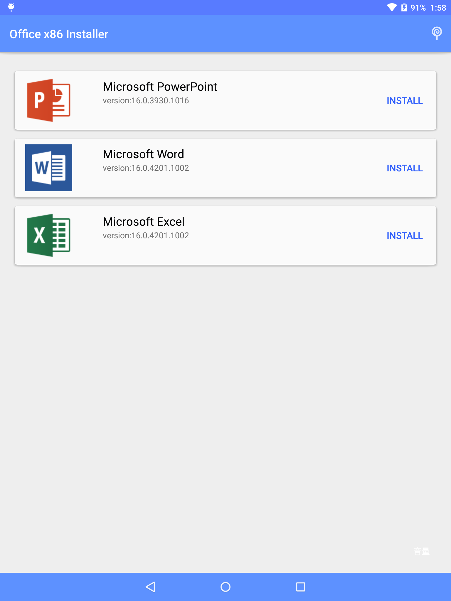

Office x86 Installer
======================
这是一个apk+数据包的自动安装器，与微软的office没有太大关系。

起因是，office的安卓平板专用版本很多设备无法访问Google Play下载，而它安装起来又是由apk+.obb文件构成，与普通安卓程序安装不同，很多用户并不会，因此写了一个自动安装器。

<h2>适用平台</h2>
Android 4.4+

<h2>截图</h2>

<h2>源码说明</h2>
为了减少源码体积，源码中引入的数据包是空文件，apk是一个随便写的小程序。产生的简化版apk程序在[在此下载](https://raw.githubusercontent.com/padeoe/Officex86-Installer/master/app/app-release.apk)(1018KB)
源程序发布于[Google+论坛](https://plus.google.com/109139169188623039028/posts/gENt2T4xTGS)(304M)，已有上百用户

